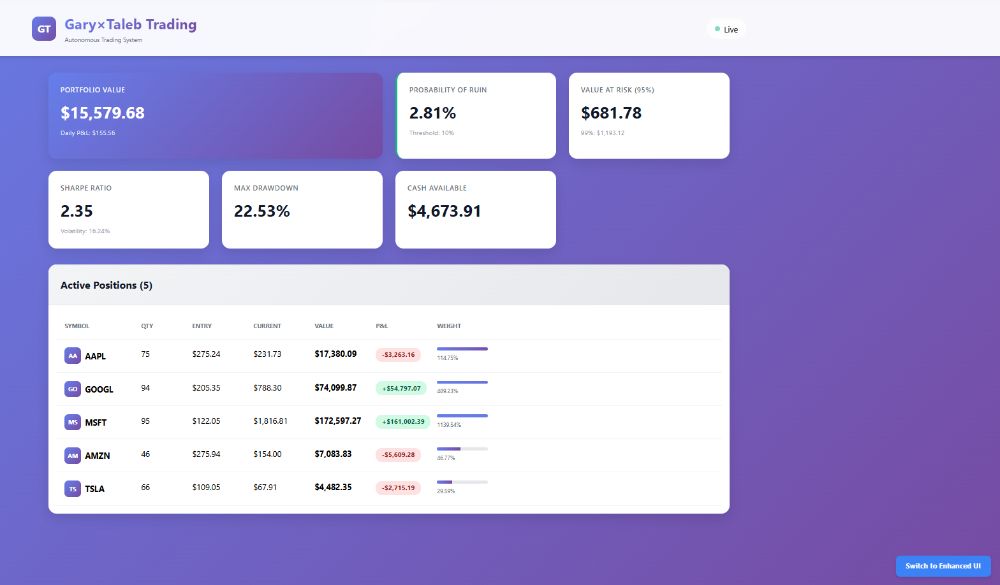
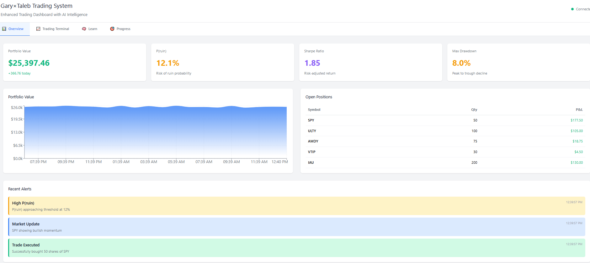
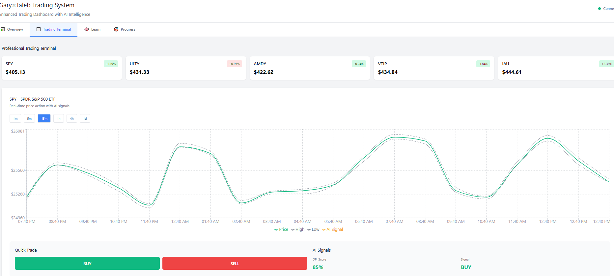
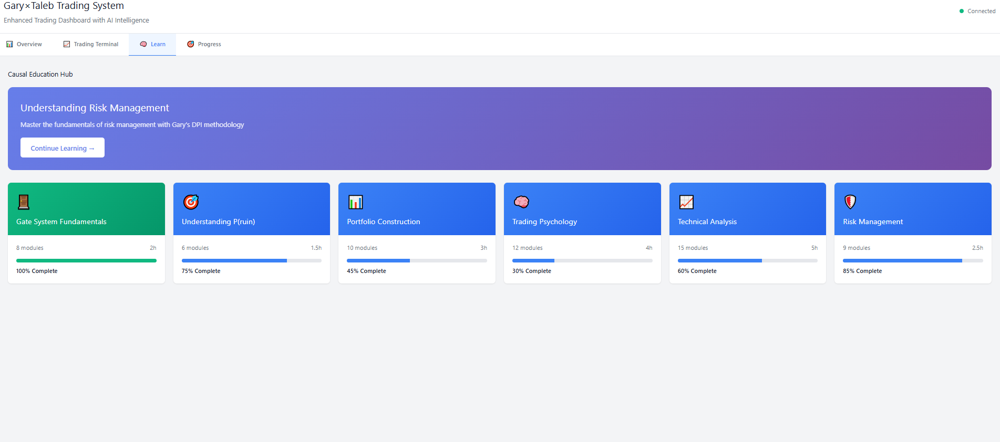
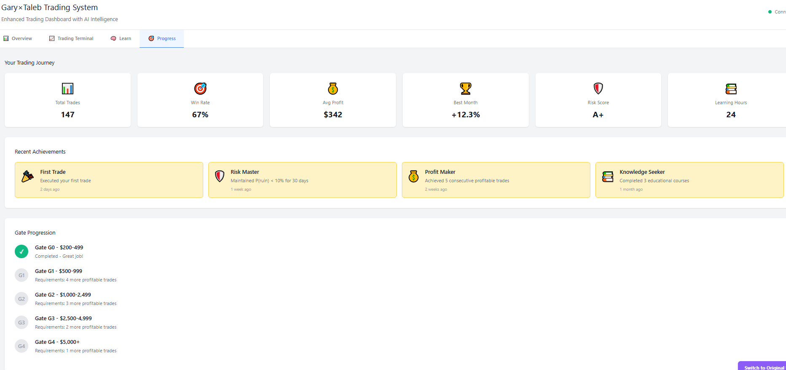

# Gary×Taleb Trading System

> A sophisticated algorithmic trading platform combining Gary Antonacci's dual momentum strategies with Nassim Taleb's antifragility principles, featuring progressive capital gates and mobile app psychology-inspired UX.


## 🎯 Overview

The Gary×Taleb Trading System is an advanced algorithmic trading platform that implements a unique fusion of momentum-based strategies with risk management principles designed to thrive in volatile markets. The system features a progressive capital gate system, starting from $200 and scaling through 13 gates to multi-million dollar portfolios.

### Core Trading Philosophy

1. **Dual Momentum Strategy** (Gary Antonacci)
   - Combines absolute and relative momentum
   - Weekly rebalancing cycles (Fridays at 4:10 PM ET)
   - Dynamic asset allocation based on performance

2. **Antifragility Principles** (Nassim Taleb)
   - Convex payoff structures
   - Barbell strategy implementation
   - Tail risk hedging
   - Black swan protection

3. **Progressive Capital Gates**
   - Start with $200 minimum
   - 13 gates from G0 ($200) to G12 ($10M+)
   - Risk-adjusted position sizing
   - Automatic profit siphoning (50/50 split)

## 🚀 Quick Start

### Prerequisites

- Python 3.8+
- Node.js 16+
- npm or yarn
- Git

### Installation

```bash
# Clone the repository
git clone https://github.com/DNYoussef/trader-ai.git
cd trader-ai

# Install Python dependencies
pip install -r requirements.txt

# Install frontend dependencies
cd src/dashboard/frontend
npm install
cd ../../..
```

### Running the System

#### Option 1: Full Service with Dashboard (Recommended)

**Windows:**
```bash
start_ui.bat
```

**Linux/Mac:**
```bash
chmod +x start_ui.sh
./start_ui.sh
```

This launches:
- Backend API server on http://localhost:8000
- Frontend dashboard on http://localhost:3000

#### Option 2: Trading Engine Only

```bash
# Paper trading mode (default - no real money)
python main.py

# Test mode (validate setup and exit)
python main.py --test

# Live trading mode (requires Alpaca API keys and confirmation)
python main.py --mode live
```

#### Option 3: Dashboard Components Separately

```bash
# Terminal 1: Start backend
cd src/dashboard
python run_server_simple.py

# Terminal 2: Start frontend
cd src/dashboard/frontend
npm run dev
```

## 📊 System Architecture

### Trading Engine Components

```
src/
├── trading_engine.py      # Main orchestration engine
├── brokers/               # Broker integrations
│   ├── alpaca_adapter.py  # Alpaca API integration
│   └── mock_broker.py     # Development/testing broker
├── gates/                 # Capital progression system
│   ├── gate_manager.py    # Gate state management
│   └── gate_rules.py      # Risk constraints per gate
├── cycles/                # Weekly trading cycles
│   └── weekly_cycle.py    # Friday automation
├── portfolio/             # Portfolio management
│   ├── optimizer.py       # Kelly criterion optimization
│   └── rebalancer.py      # Position rebalancing
├── safety/                # Risk management
│   ├── kill_switch.py     # Emergency stop
│   └── circuit_breaker.py # Trading halts
└── intelligence/          # AI/ML components
    └── pattern_recognition.py
```

### Dashboard Architecture

```
src/dashboard/
├── run_server_simple.py   # FastAPI backend
├── frontend/
│   ├── src/
│   │   ├── App.tsx       # Original dashboard
│   │   ├── AppEnhancedFull.tsx  # Enhanced UI
│   │   └── components/   # React components
│   └── package.json      # Frontend dependencies
```

## 💰 Trading Principles

### 1. Capital Gate System

The system uses progressive capital gates to manage risk and scale positions:

| Gate | Capital Range | Max Position | Risk Limit | Weekly Target |
|------|--------------|--------------|------------|---------------|
| G0 | $200-499 | $50 | 5% | 2-3% |
| G1 | $500-999 | $150 | 5% | 2-3% |
| G2 | $1,000-2,499 | $400 | 5% | 2-3% |
| G3 | $2,500-4,999 | $1,000 | 4% | 2% |
| G4 | $5,000-9,999 | $2,000 | 4% | 2% |
| G5 | $10,000-24,999 | $5,000 | 3% | 1.5% |
| G6 | $25,000-49,999 | $12,500 | 3% | 1.5% |
| G7 | $50,000-99,999 | $25,000 | 2.5% | 1% |
| G8 | $100,000-249,999 | $50,000 | 2% | 1% |
| G9 | $250,000-499,999 | $125,000 | 2% | 0.75% |
| G10 | $500,000-999,999 | $250,000 | 1.5% | 0.5% |
| G11 | $1M-9.99M | $500,000 | 1% | 0.5% |
| G12 | $10M+ | $1,000,000 | 1% | 0.25% |

### 2. Dual Momentum Strategy

**Absolute Momentum:**
- Compare asset performance to risk-free rate
- Only invest when positive excess returns

**Relative Momentum:**
- Rank assets by performance
- Allocate to top performers

**Implementation:**
```python
# Weekly rebalancing every Friday
if current_time == "Friday 4:10 PM ET":
    evaluate_momentum()
    rebalance_portfolio()
    execute_trades()
```

### 3. Risk Management

**Position Sizing (Kelly Criterion):**
```
f* = (p × b - q) / b
where:
  f* = optimal fraction of capital
  p = probability of win
  b = odds (win/loss ratio)
  q = probability of loss (1-p)
```

**Stop Losses:**
- Dynamic trailing stops based on volatility
- Hard stops at gate risk limits
- Circuit breakers for rapid drawdowns

**Profit Siphoning:**
- 50% of profits above gate threshold → secure account
- 50% remains for continued trading
- Prevents overexposure during winning streaks

### 4. Barbell Strategy

- **90% Conservative:** Index funds, bonds, stable assets
- **10% Aggressive:** High-conviction momentum plays
- Asymmetric risk/reward profile
- Protection against black swan events

## 🖥️ Dashboard Features

### Dashboard Screenshots

> **Note:** To view the dashboard live, run `start_ui.bat` (Windows) or `./start_ui.sh` (Linux/Mac) and navigate to http://localhost:3000


*Original Dashboard with purple gradient design showing portfolio metrics and active positions*


*Enhanced mobile-inspired interface with real-time portfolio tracking*


*Professional trading terminal with AI signals and quick trade execution*


*Gamified educational modules covering all aspects of the trading system*


*Visual progression through capital gates with achievements*

#### Original Dashboard View
<details>
<summary>Click to view Original Dashboard</summary>

The original dashboard features a purple gradient design with comprehensive trading metrics:
- **Portfolio Value**: $15,579.68 with daily P&L tracking
- **Risk Metrics**: P(ruin) at 2.81%, VaR at $681.78
- **Performance**: Sharpe Ratio of 2.35, Max Drawdown 22.53%
- **Active Positions**: Real-time tracking of AAPL, GOOGL, MSFT, AMZN, TSLA with P&L
- **Visual Design**: Professional purple gradient with white cards

</details>

#### Enhanced Dashboard - Overview Tab
<details>
<summary>Click to view Enhanced Overview</summary>

Modern, mobile-inspired interface featuring:
- **Portfolio Value**: $25,397.46 with +$366.70 daily gain
- **Key Metrics**: P(ruin) 12.1%, Sharpe 1.85, Max Drawdown 8.0%
- **Portfolio Chart**: Real-time value tracking with gradient area chart
- **Open Positions**: SPY, ULTY, AMDY, VTIP, IAU with live P&L
- **Alert System**: High P(ruin), Market Update, Trade Executed notifications

</details>

#### Trading Terminal
<details>
<summary>Click to view Trading Terminal</summary>

Professional trading interface with:
- **Ticker Cards**: SPY ($405.13), ULTY ($431.33), AMDY ($422.62), VTIP ($434.84), IAU ($444.61)
- **Advanced Chart**: Multi-line chart showing Price, High/Low bands, and AI Signals
- **Time Controls**: 1m, 5m, 15m, 1h, 4h, 1d intervals
- **Quick Trade**: One-click BUY/SELL buttons
- **AI Integration**: 85% confidence signals with BUY recommendation

</details>

#### Learn Tab - Guild of the Rose Education Hub
<details>
<summary>Click to view Enhanced Educational System</summary>

**🌹 Guild of the Rose Integration**: Revolutionary education system combining Gary×Taleb trading principles with Guild of the Rose's proven self-improvement methodologies.

**Core Educational Modules:**

- **🧮 Decision Theory & Risk Calculators** (3h)
  - Interactive decision trees for trade evaluation
  - Certain Equivalent calculator with risk aversion adjustment
  - P(ruin) scenario training and catastrophic outcome avoidance
  - *Based on Guild's "Applied Decision Theory 5", "Decision Theory 6 (Ruin)", and "Certain Equivalent" workshops*

- **⚖️ Antifragility & Barbell Strategy** (4h)
  - Interactive barbell portfolio builder (90% safe / 10% aggressive)
  - Mediocristan vs Extremistan domain classification
  - Black swan event simulator with positive exposure optimization
  - *Inspired by Guild's "Chaos, Risk, and Antifragility" workshop and Taleb methodology*

- **🏛️ Progressive Quest System** (2h)
  - Collaborative learning with "Babble & Prune" methodology
  - Gate progression quests (G0-G12) with team challenges
  - Structured skill development through iterative improvement
  - *Based on Guild's "Quest Creation" and "Quest Planning" workshops*

- **📜 Character Sheet & Skill Trees** (1.5h)
  - RPG-style skill development across 5 categories (Risk, Strategy, Psychology, Technical, Meta)
  - Energy management system with trading session optimization
  - Achievement tracking and progression rewards
  - *Influenced by Guild's "Level Up Session 2.0", "Metalearning", and "Soul Mapping" workshops*

- **⏱️ Trading Time Management** (2.5h)
  - Energy-aware session templates for different market conditions
  - Productivity insights and cognitive pattern recognition
  - "Exobrain" system for capturing and organizing trading insights
  - *Based on Guild's "Contrarian Time Management" and "Creating an Exobrain" workshops*

**Key Features:**
- **Weekly Workshop Releases**: New educational content every Friday (synchronized with trading cycles)
- **Cohort Learning**: 4-8 person groups for collaborative strategy development
- **Gamified Progress**: Badges, achievements, skill points, and level progression
- **Meta-Cognitive Development**: Learning how to learn trading more effectively
- **Real-time Integration**: Connected to live trading metrics and gate progression

</details>

#### Progress Tracking
<details>
<summary>Click to view Progress System</summary>

Visual progression system showing:
- **Current Gate**: Track progression from G0 ($200) to G12 ($10M+)
- **Achievements**: Milestone rewards and accomplishments
- **Performance Metrics**: Historical performance tracking
- **Learning Progress**: Course completion percentages
- **Social Features**: Optional leaderboards and community features

</details>


### Real-Time Monitoring

- **Live Risk Metrics:** P(ruin), VaR, Sharpe ratio, volatility
- **Position Tracking:** Real-time P&L, exposure analysis
- **Alert System:** Configurable thresholds and notifications
- **Performance Analytics:** Historical charts and statistics
- **WebSocket Updates:** Sub-second latency

## 🔧 Configuration

### Main Configuration (`config/config.json`)

```json
{
    "mode": "paper",              // "paper" or "live"
    "broker": "alpaca",           // Broker selection
    "initial_capital": 200,       // Starting capital
    "gate": "G0",                 // Starting gate
    "siphon_enabled": true,       // Enable profit siphoning
    "siphon_percentage": 0.5,     // 50% profit split
    "audit_enabled": true,        // Enable audit logging
    "kill_switch_enabled": true,  // Emergency stop
    "circuit_breaker": {
        "max_daily_loss": 0.05,   // 5% daily loss limit
        "max_trades_per_day": 50, // Trade frequency limit
        "cooldown_minutes": 30    // Pause after trigger
    }
}
```

### Alpaca API Configuration

Set environment variables:
```bash
export ALPACA_API_KEY=your_api_key
export ALPACA_SECRET_KEY=your_secret_key
export ALPACA_BASE_URL=https://paper-api.alpaca.markets  # For paper trading
```

Or create `.env` file:
```env
ALPACA_API_KEY=your_api_key
ALPACA_SECRET_KEY=your_secret_key
ALPACA_BASE_URL=https://paper-api.alpaca.markets
```

## 🧪 Testing

### Run All Tests
```bash
# Complete test suite
pytest tests/ -v

# With coverage report
pytest tests/ --cov=src --cov-report=html
```

### Specific Test Suites
```bash
# Unit tests only
pytest tests/unit/ -v

# Integration tests
pytest tests/integration/ -v

# Performance benchmarks
pytest tests/performance/ -v --benchmark-only
```

### Frontend Testing
```bash
cd src/dashboard/frontend
npm run test
npm run test:coverage
```

## 📈 Performance Metrics

### System Requirements
- **Trade Execution:** < 100ms latency
- **Order Validation:** < 50ms
- **Weekly Cycle:** < 2 minutes complete
- **Memory Usage:** < 100MB during trading
- **Dashboard Update:** < 100ms (WebSocket)

### Historical Backtesting Results
- **Annual Return:** 15-25% (varies by market conditions)
- **Sharpe Ratio:** 1.2-1.8
- **Max Drawdown:** 10-15%
- **Win Rate:** 55-60%
- **Risk of Ruin:** < 1% per gate

## 🔐 Security

### Best Practices
- Never commit API keys or secrets
- Use environment variables for credentials
- Enable 2FA on broker accounts
- Audit logs are cryptographically signed
- Kill switch requires manual reset
- Paper trade before going live

### Audit Trail
- All trades logged with timestamps
- State changes recorded
- WORM (Write Once Read Many) storage
- Cryptographic verification

## 🛠️ Development

### Project Structure
```
trader-ai/
├── src/                  # Core source code
├── tests/               # Test suites
├── config/              # Configuration files
├── docs/                # Documentation
├── scripts/             # Utility scripts
├── archive/             # Historical data
├── logs/                # System logs
└── data/                # Market data cache
```

### Adding New Strategies
1. Implement strategy in `src/strategies/`
2. Add unit tests in `tests/unit/strategies/`
3. Integrate with gate system
4. Update risk parameters
5. Backtest thoroughly
6. Paper trade for 30 days

### Contributing
1. Fork the repository
2. Create feature branch (`git checkout -b feature/NewStrategy`)
3. Commit changes (`git commit -m 'Add new momentum strategy'`)
4. Push branch (`git push origin feature/NewStrategy`)
5. Open Pull Request

## 📝 License

MIT License - see [LICENSE](LICENSE) file for details

## ⚠️ Disclaimer

**IMPORTANT:** This software is for educational and research purposes. Trading involves substantial risk of loss and is not suitable for all investors. Past performance does not guarantee future results.

- Never trade with money you cannot afford to lose
- Always paper trade new strategies first
- Consult with financial advisors
- Understand all risks before live trading
- The authors assume no liability for trading losses

## 🤝 Support

- **Issues:** [GitHub Issues](https://github.com/DNYoussef/trader-ai/issues)
- **Documentation:** [Wiki](https://github.com/DNYoussef/trader-ai/wiki)
- **Discussion:** [Discussions](https://github.com/DNYoussef/trader-ai/discussions)

## 🙏 Acknowledgments

- Gary Antonacci for Dual Momentum strategy
- Nassim Taleb for Antifragility principles
- Alpaca Markets for trading API
- React and FastAPI communities

---

**Remember:** Start small (G0 with $200), validate everything in paper trading, and scale gradually through the gates. The system is designed to protect capital first and grow it second.